<h1 align="center">Cortex for Obsidian</h1>

<h2 align="center">
The Ultimate AI Assistant for Your Second Brain
</h2>

  
  

  <a href="https://www.youtube.com/@loganhallucinates">Youtube</a> |
  <a href="https://github.com/logancyang/obsidian-cortex/issues/new?template=bug_report.md">Report Bug</a> |
  <a href="https://github.com/logancyang/obsidian-cortex/issues/new?template=feature_request.md">Request Feature</a>

  

## The What

_Cortex for Obsidian_ is your in‑vault AI assistant with chat-based vault search, web and YouTube support, powerful context processing, and ever-expanding agentic capabilities within Obsidian's highly customizable workspace - all while keeping your data under **your** control.

## The Why

Today's AI giants want **you trapped**: your data on their servers, prompts locked to their models, and switching costs that keep you paying. When they change pricing, shut down features, or terminate your account, you lose everything you built.

We are building the opposite. Our goal is to create a portable agentic experience with no provider lock-in. **Data is always yours.** Use whatever LLM you like. Imagine that a brand new model drops, you run it on your own hardware, and it already knows about you (_long-term memory_), knows how to run _the same commands and tools_ you have defined over time (as just markdown files), and becomes the thought partner and assistant that you _own_. This is AI that grows with you, not a subscription you're hostage to.

This is the future we believe in. If you share this vision, please support this project!

## Key Features

- **🔒 Your data is 100% yours**: Local search and storage, and full control of your data if you use self-hosted models.
- **🧠 Bring Your Own Model**: Tap any OpenAI-compatible or local model to uncover insights, spark connections, and create content.
- **🖼️ Multimedia understanding**: Drop in webpages, YouTube videos, images, PDFs, EPUBS, or real-time web search for quick insights.
- **🔍 Smart Vault Search**: Search your vault with chat, no setup required. Embeddings are optional. Cortex delivers results right away.
- **✍️ Composer and Quick Commands**: Interact with your writing with chat, apply changes with 1 click.
- **🗂️ Project Mode**: Create AI-ready context based on folders and tags. Think NotebookLM but inside your vault!
- **🤖 Agent Mode**: Unlock an autonomous agent with built-in tool calling. No commands needed. Cortex automatically triggers vault, web searches or any other relevant tool when appropriate.

  <em>Cortex's Agent can call the proper tools on its own upon your request.</em>

  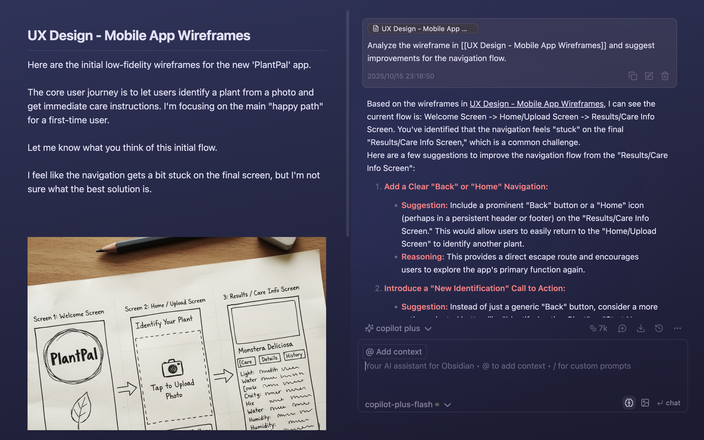

## Get Started

### Install Obsidian Cortex

1. Open **Obsidian → Settings → Community plugins**.
2. Turn off **Safe mode** (if enabled).
3. Click **Browse**, search for **“Cortex for Obsidian”**.
4. Click **Install**, then **Enable**.

### Set API Keys

1. Go to **Obsidian → Settings → Cortex → Basic** and click **Set Keys**.
2. Choose your AI provider(s) (e.g., **OpenRouter, Gemini, OpenAI, Anthropic, Cohere**) and paste your API key(s). **OpenRouter is recommended.**

## Usage

### Table of Contents

- [The What](#the-what)
- [The Why](#the-why)
- [Key Features](#key-features)
- [Get Started](#get-started)
- [Usage](#usage)
- [Need Help?](#need-help)
- [FAQ](#faq)

### Core Workflow

#### **Chat Mode: reference notes and discuss ideas with Cortex**

Use `@` to add context and chat with your note.

    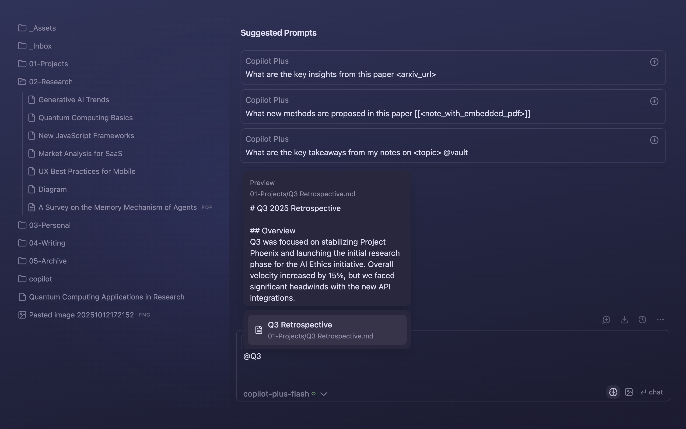

Ask Cortex:

> _Summarize [[Q3 Retrospective]] and identify the top 3 action items for Q4 based on the notes in {01-Projects}._

    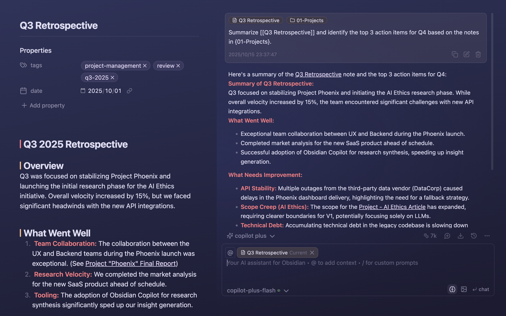

#### **Vault QA Mode: chat with your entire vault**

Ask Cortex:

> _What are the recurring themes in my research regarding the intersection of AI and SaaS?_

    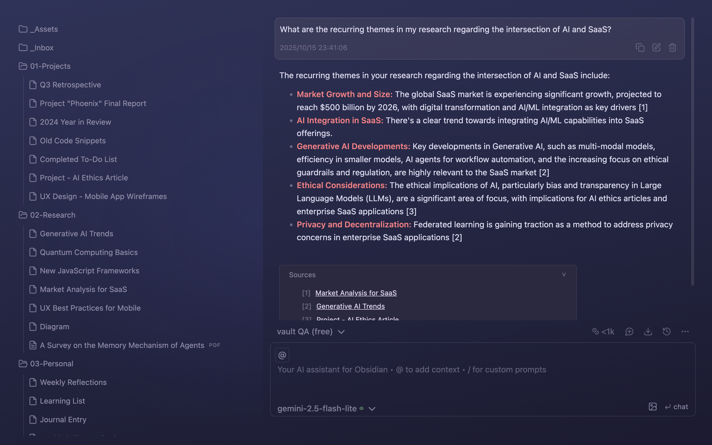

#### Cortex's Command Palette

Cortex's Command Palette puts powerful AI capabilities at your fingertips. Access all commands in chat window via `/` or via
right-click menu on selected text.

**Add selection to chat context**

Select text and add it to context. Recommend shortcut: `ctrl/cmd + L`

    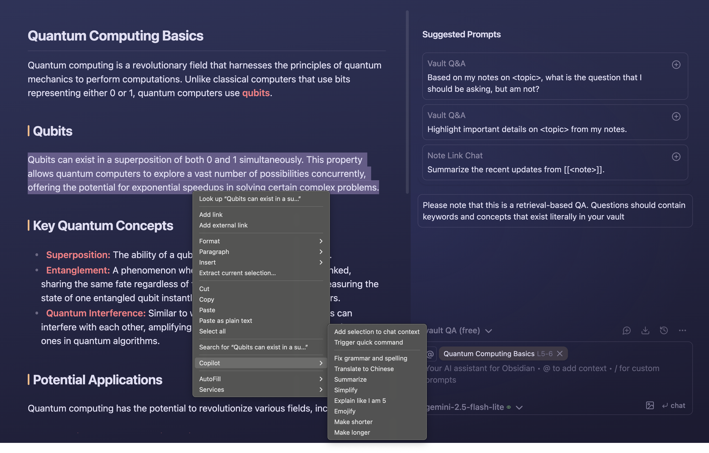

**Quick Command**

Select text and apply action without opening chat. Recommend shortcut: `ctrl/cmd + K`

    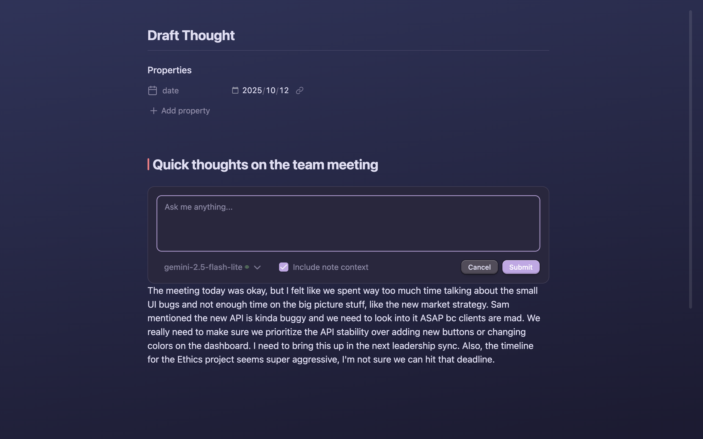

**Edit and Apply with One Click**

Select text and edit with one RIGHT click.

    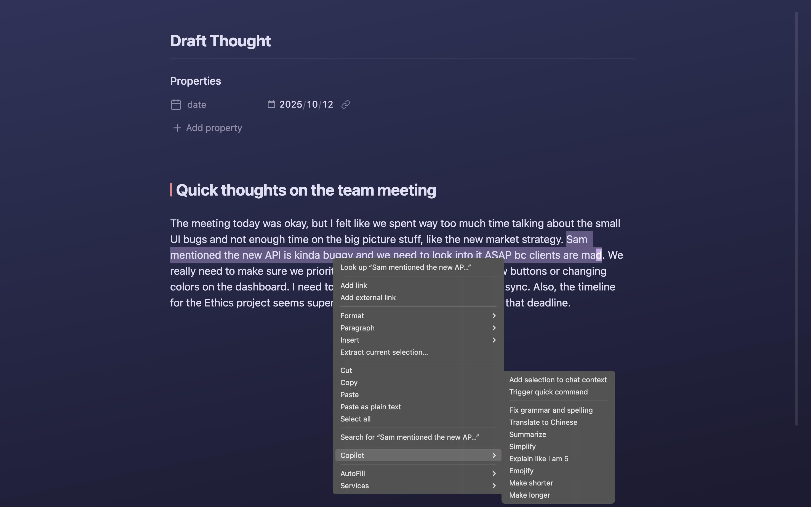

**Create your Command**

Create commands and workflows in `Settings → Cortex → Command → Add Cmd`.

    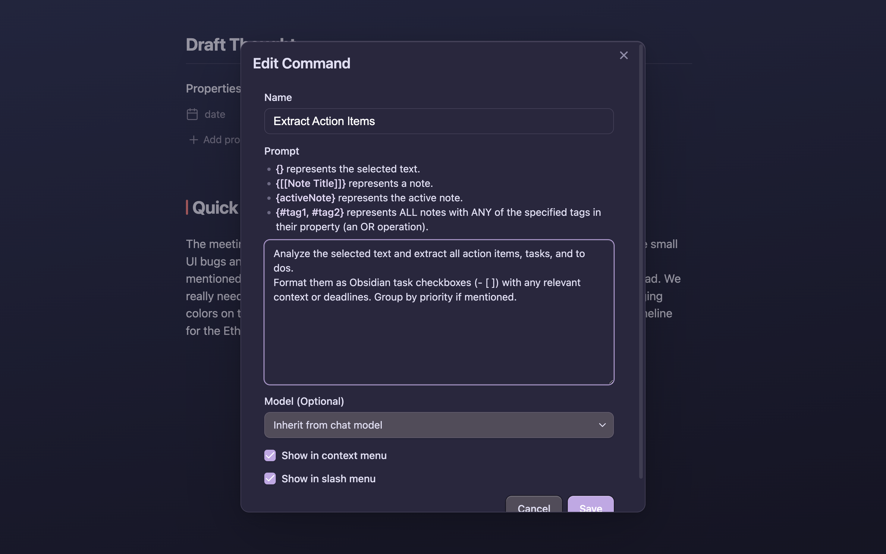

**Command Palette in Chat**

Type `/` to use Command Palette in chat window.

    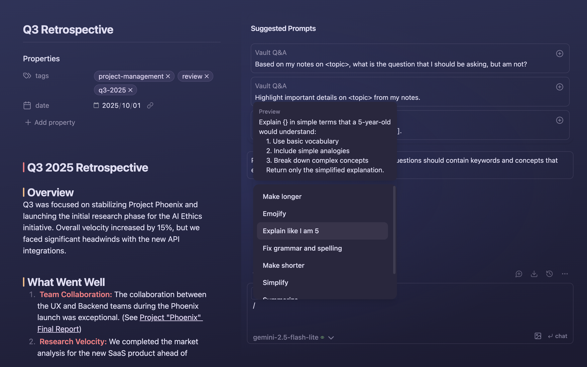

#### **Relevant Notes: notes suggestions based on semantic similarity and links**

Appears automatically when there's useful related content and links.

Use it to quickly reference past research, ideas, or decisions—no need to search or switch tabs.

    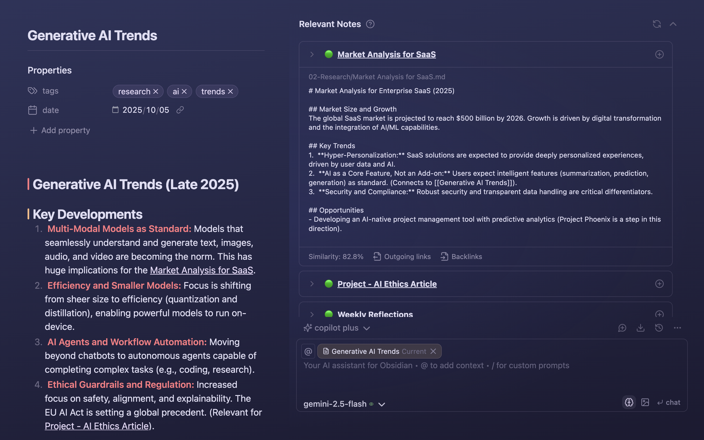

#### Advanced Capabilities

Cortex brings powerful context-aware actions and seamless tool integration—built to elevate your knowledge work in Obsidian.

#### **Get Precision Insights From a Specific Time Window**

In agent mode, ask Cortex:

> _What did I do last week?_

    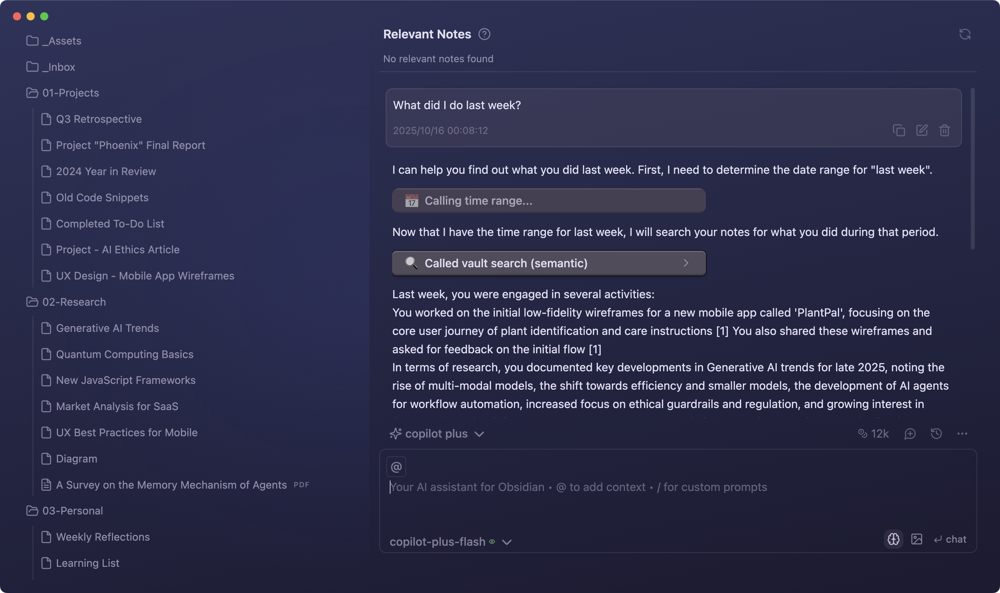

#### **Agent Mode: Autonomous Tool Calling**

Cortex's agent automatically calls the right tools—no manual commands needed. Just ask, and it searches the web, queries your vault, and combines insights seamlessly.

Ask Cortex:

> _Research web and my vault and draft a note on AI SaaS onboarding best practices._

    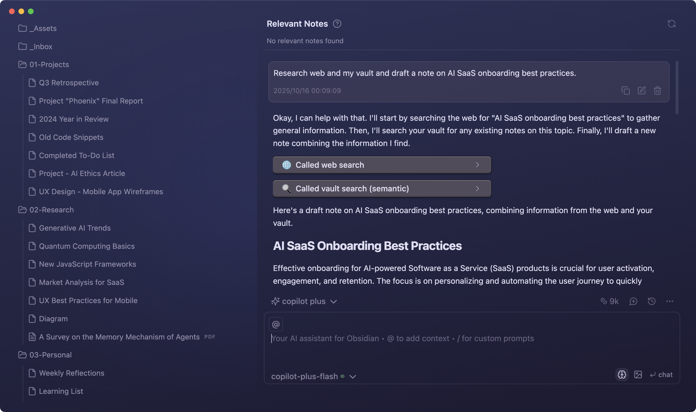

#### **Understand Images in Your Notes**

Cortex can analyze images embedded in your notes—from wireframes and diagrams to screenshots and photos. Get detailed feedback, suggestions, and insights based on visual content.

Ask Cortex to analyze your wireframes:

> _Analyze the wireframe in [[UX Design - Mobile App Wireframes]] and suggest improvements for the navigation flow._

    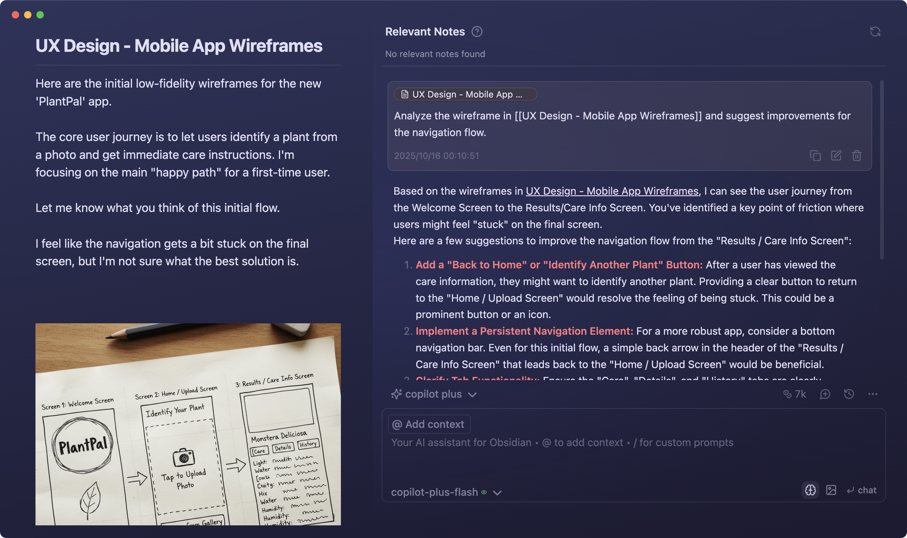

#### **One Prompt, Every Source—Instant Summaries from PDFs, Videos, and Web**

In agent mode, ask Cortex

> \*Compare the information about [Agent Memory] from this youtube video: [URL], this PDF [file], and @web[search results]. Start with your

     conclusion in bullet points in your response*

    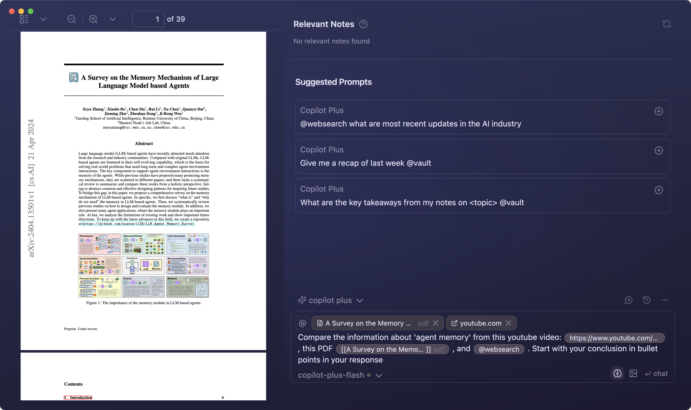

## **Need Help?**

- Watch [Youtube](https://www.youtube.com/@loganhallucinates) for walkthroughs.
- If you're experiencing a bug or have a feature idea, please follow the steps below to help us help you faster:
  - 🐛 Bug Report Checklist
    - ☑️Use the [bug report template](https://github.com/logancyang/obsidian-cortex/issues/new?template=bug_report.md) when reporting an issue
    - ☑️Enable Debug Mode in Cortex Settings → Advanced for more detailed logs
    - ☑️Open the dev console to collect error messages:
      - Mac: Cmd + Option + I
      - Windows: Ctrl + Shift + I
    - ☑️Turn off all other plugins, keeping only Cortex enabled
    - ☑️Attach relevant console logs to your report
    - ☑️Submit your bug report [here](https://github.com/logancyang/obsidian-cortex/issues/new?template=bug_report.md)
  - 💡 Feature Request Checklist
    - ☑️Use the [feature request template](https://github.com/logancyang/obsidian-cortex/issues/new?template=feature_request.md) for requesting a new feature
    - ☑️Clearly describe the feature, why it matters, and how it would help
    - ☑️Submit your feature request [here](https://github.com/logancyang/obsidian-cortex/issues/new?template=feature_request.md)

## **FAQ**

  
<strong>Why isn’t Vault search finding my notes?</strong>

If you're using the Vault QA mode (or the tool `@vault`), try the following:

- Ensure you have a working embedding model from your AI model's provider (e.g. OpenAI). Watch this video: [AI Model Setup (API Key)](https://www.youtube.com/watch?v=mzMbiamzOqM)
- Ensure your Cortex indexing is up-to-date. Watch this video: [Vault Mode](https://www.youtube.com/watch?v=hBLMWE8WRFU)
- If issues persist, run <strong>Force Re-Index</strong> or use <strong>List Indexed Files</strong> from the Command Palette to inspect what's included in the index.
- ⚠️ <strong>Don’t switch embedding models after indexing</strong>—it can break the results.

  
<strong>Why is my AI model returning error code 429: ‘Insufficient Quota’?</strong>

Most likely this is happening because you haven’t configured billing with your chosen model provider—or you’ve hit your monthly quota. For example, OpenAI typically caps individual accounts at $120/month. To resolve:

- ▶️ Watch the “AI Model Setup” video: [AI Model Setup (API Key)](https://www.youtube.com/watch?v=mzMbiamzOqM)
- 🔍 Verify your billing settings in your OpenAI dashboard
- 💳 Add a payment method if one isn’t already on file
- 📊 Check your usage dashboard for any quota or limit warnings

If you’re using a different provider, please refer to their documentation and billing policies for the equivalent steps.

  
<strong>Why am I getting a token limit error?</strong>

Please refer to your model provider’s documentation for the context window size.

⚠️ If you set a large <strong>max token limit</strong> in your Cortex settings, you may encounter this error.

- <strong>Max tokens</strong> refers to <em>completion tokens</em>, not input tokens.
- A higher output token limit means less room for input!

🧠 Behind-the-scenes prompts for Cortex commands also consume tokens, so:

- Keep your message length short
- Set a reasonable max token value to avoid hitting the cap

💡 For QA with unlimited context, switch to the <strong>Vault QA</strong> mode in the dropdown (Cortex v2.1.0+ required).

## **🙏 Thank You**

If you share the vision of building the most powerful AI agent for our second brain, consider [sponsoring this project](https://github.com/sponsors/logancyang) or buying me a coffee. Help spread the word by sharing Cortex for Obsidian on Twitter/X, Reddit, or your favorite platform!

  

**Acknowledgments**

Special thanks to our top sponsors: @mikelaaron, @pedramamini, @Arlorean, @dashinja, @azagore, @MTGMAD, @gpythomas, @emaynard, @scmarinelli, @borthwick, @adamhill, @gluecode, @rusi, @timgrote, @JiaruiYu-Consilium, @ddocta, @AMOz1, @chchwy, @pborenstein, @GitTom, @kazukgw, @mjluser1, @joesfer, @rwaal, @turnoutnow-harpreet, @dreznicek, @xrise-informatik, @jeremygentles, @ZhengRui, @bfoujols, @jsmith0475, @pagiaddlemon, @sebbyyyywebbyyy, @royschwartz2, @vikram11, @amiable-dev, @khalidhalim, @DrJsPBs, @chishaku, @Andrea18500, @shayonpal, @rhm2k, @snorcup, @JohnBub, @obstinatelark, @jonashaefele, @vishnu2kmohan

## **Authors**

Team | X/Twitter: [@logancyang](https://twitter.com/logancyang)
